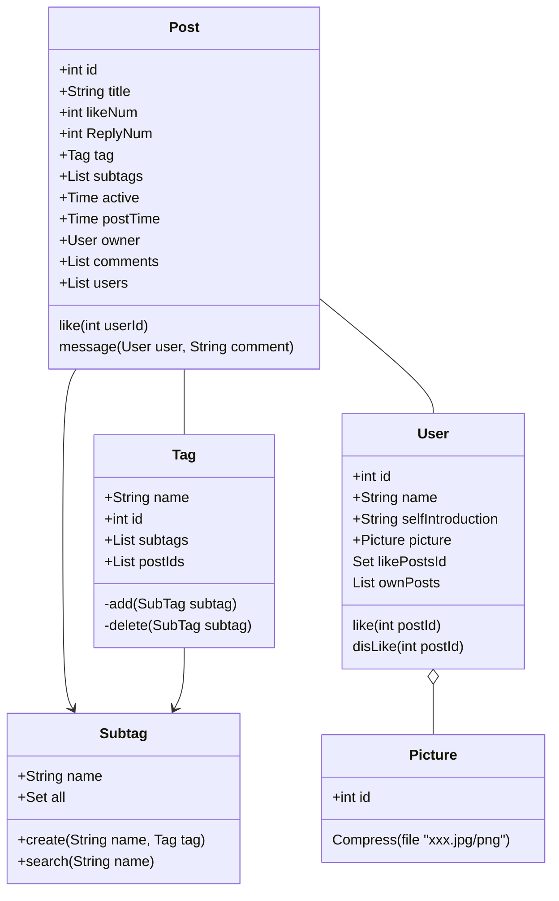

```mermaid
classDiagram
	class Post
	class User
	class Tag
	class Subtag
	class Picture
	
	User o-- Picture
	Post --> Subtag
	Post -- User
	Tag --> Subtag
	Post -- Tag
	
    Post : +int id
    Post : +String title
    Post : +int likeNum
    Post : +int ReplyNum
    Post : +Tag tag
    Post : +List<Subtag> subtags
    Post : +Time active
    Post : +Time postTime
    Post : +User owner
    Post : +List<String> comments 
    Post : +List<User> users
    Post : like(int userId)
    Post : message(User user, String comment)
      
      
    Tag : +String name
    Tag : +int id
    Tag : +List<SubTag> subtags
    Tag : +List<int> postIds
    Tag : -add(SubTag subtag)
    Tag : -delete(SubTag subtag)
      
    Subtag : +String name
    Subtag : +Set<Subtag> all
    Subtag : +create(String name, Tag tag)
    Subtag : +search(String name)
      
    User : +int id
    User : +String name
    User : +String selfIntroduction
    User : +Picture picture
    User : Set<int> likePostsId
    User : like(int postId)
    User : disLike(int postId)
    User : List<Post> ownPosts
         
    Picture : +int id
    Picture : Compress(file "xxx.jpg/png")
     
    
```